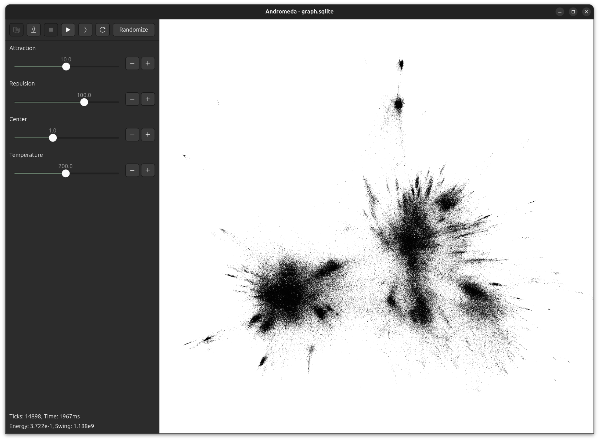

# Andromeda

Andromeda is a high-performance force-directed graph layout engine written in Zig using GTK and OpenGL.



Zig version `0.14.0`.

```
$ zig build run
```

Your SQLite database should have a schema that looks like this:

```sql
CREATE TABLE nodes(
  id INTEGER PRIMARY KEY NOT NULL,
  x FLOAT NOT NULL DEFAULT 0,
  y FLOAT NOT NULL DEFAULT 0
);

CREATE TABLE edges(
  source INTEGER NOT NULL REFERENCES nodes(id),
  target INTEGER NOT NULL REFERENCES nodes(id)
);
```
